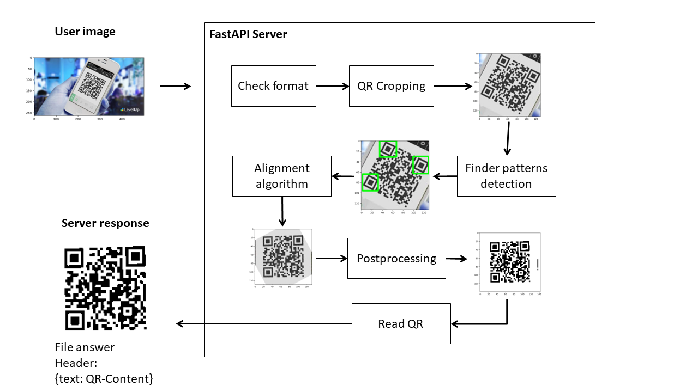
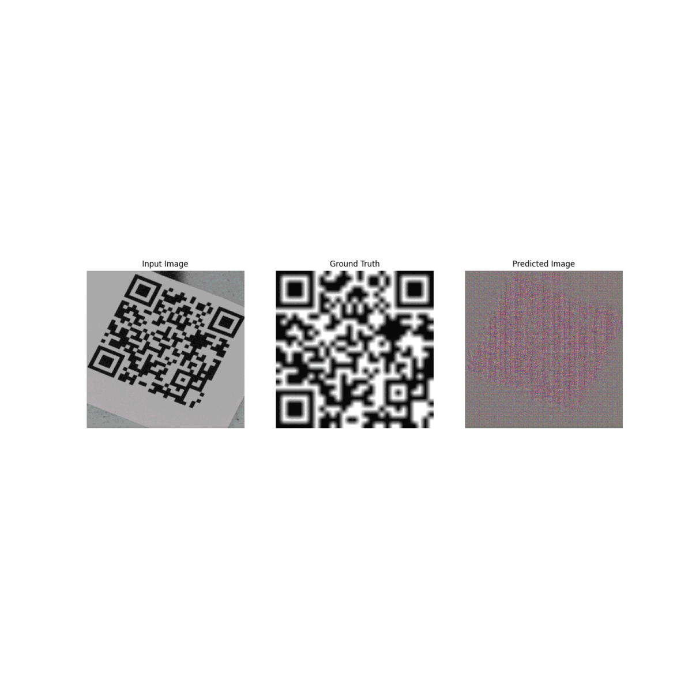

# QR Code Seeker

  
This project leverages machine learning technology to robustly detect, precisely crop, and accurately align QR codes within a wide range of images. To accomplish this, we employ the cutting-edge YOLOv8 model, fine-tuned through a customized training process, in conjunction with a Pix2Pix architecture.

## Table of Contents

- [QR Code Seeker](#qr-code-seeker)
  - [Table of Contents](#table-of-contents)
  - [Overview](#overview)
  - [Features](#features)
    - [Architecture](#architecture)
    - [Detection and Croping](#detection-and-croping)
    - [Alignment](#alignment)
    - [The Initial Setback](#the-initial-setback)
  - [The API](#the-api)
  - [Local pipeline](#local-pipeline)
  - [To do](#to-do)

## Overview

The task of QR code detection is a common benchmark used to demonstrate proficiency in machine learning projects. In this project, however, my aim extends beyond merely solving this task; I aspire to explore diverse and innovative approaches to its solution.

The central focus of this project revolves around YOLO, which stands for "You Only Look Once." YOLO is a state-of-the-art object detection framework in the field of computer vision and machine learning. Unlike traditional detection methods, YOLO has gained immense popularity due to its ability to simultaneously locate and classify objects in real-time, making it exceptionally efficient and suitable for various applications such as image analysis, surveillance, and, in our case, QR code detection. YOLO's hallmark is its ability to process an entire image in a single pass, resulting in rapid and accurate object detection, which is a key component of our project's success.

## Features

To develop this project we need to think:

### Architecture

To effectively tackle this task, I've broken it down into three distinct steps:
1. Initially, we embark on the process of detecting and cropping the precise location of the QR Code within the image. 
2. Subsequently, we employ alignment techniques to optimize the QR code's orientation for enhanced results. 
3. Lastly, we enhance the overall image quality. 

You can gain a visual understanding of these steps in first figure of this document, which illustrates this concept.


### Detection and Croping

The leading and contemporary tool in the realm of object detection is YOLOv8. This pretrained model plays a pivotal role in the accurate identification and delineation of objects within images. For our specific project, I performed fine-tuning on this model to enable it to excel at detecting QR codes and precisely cropping them from the original images.

The dataset I utilized for this fine-tuning is available at https://www.kaggle.com/datasets/hamidl/yoloqrlabeled. This dataset comprises real-world images containing QR codes, along with corresponding polygons that contain the QR code. This wealth of data provides the necessary information and resources to effectively address the task at hand.

### Alignment

Achieving alignment is a complex challenge due to the potential rotation of QR codes in any direction. To tackle this, I harnessed YOLOv8 once again, but this time with a specific focus on detecting the finder pattern within the QR code. The dataset used for this purpose can be accessed at the following URL: https://www.kaggle.com/datasets/samygrisard/finder-patterns-qr-code. Leveraging the information gathered from this dataset, I applied principles of linear algebra to calculate the necessary angle and transformation required to align the QR code effectively.

### The Initial Setback

Initially, my intention was to construct a custom machine learning model from the ground up using TensorFlow and Keras, based on the Pix2Pix architecture. I diligently studied the associated research paper, enhancing my understanding of the underlying principles. I proceeded to implement the model in Colab, utilizing the dataset available at http://www.fit.vutbr.cz/research/groups/graph/pclines/pub_page.php?id=2012-JRTIP-MatrixCode. However, during the training phase, the model encountered an overflow issue. Upon investigation, I identified an underlying problem—the dataset was unbalanced, with one QR code occurring 33 times more frequently than others. Consequently, the neural network learned to prioritize these overrepresented images, ultimately minimizing the loss function.

I made efforts to rectify this imbalance through data augmentation techniques, but the results remained unsatisfactory. Faced with this challenge, I shifted my approach in the project towards YOLO. For a visual representation of the Pix2Pix architecture during training, please refer to Figure 2.



## The API

This project features an accessible API built with FastAPI and deployed on Oracle Cloud Infrastructure (OCI). You can conveniently access the API by following this link: http://139.177.102.204/. Additionally, I've designed a user-friendly webpage for streamlined testing and interaction with the API, although it's still a work in progress. To access the interface, please refer to the FastAPI documentation for this project, available at http://139.177.102.204/docs. You can also use the following animation as a guide.


## Local pipeline

Follow these steps to set up and run the project:

1. Clone this repository:
   ```
   git clone https://github.com/CarlosMena01/QRCodeSeeker-ML
   ```
2. Create a virtual environment (recommended for isolating dependencies):

- For Linux:

  ```
  python -m venv venv
  source venv/bin/activate
  ```

- For Windows:
  ```
  python -m venv venv
  venv\Scripts\activate
  ```

3. Install the required dependencies:

   ```
   pip install -r requirements.txt
   ```

4. Run the server:
   ```
   uvicorn src/main:app
   ```

## To do
- Finish the fronted interface
- Implement the pix2pix code on the architecture

---

Enjoy the project :3
